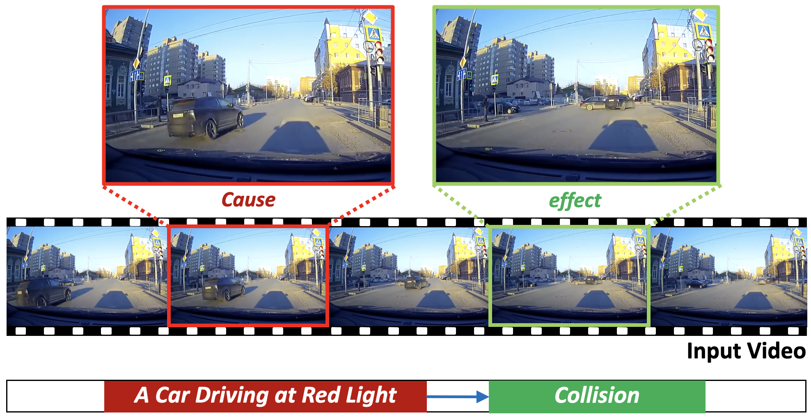

# Causality In Traffic Accident (Under Construction)
Repository for Traffic Accident Benchmark for Causality Recognition (ECCV 2020)

## Overview


## Data Preparation
[Details of dataset construction](dataset/DATASET.md)

## Benchmark
### Cause and Effect Event Classification
We adopt Temporal Segment Networks (ECCV 2016) from the repository https://github.com/yjxiong/tsn-pytorch
- The default arguments for code are set to train TSN with average consensus function.
```
python train_classifier.py --consensus_type average
python train_classifier.py --consensus_type linear
```

### Temporal Cause and Effect Event Localization
We adopt three types of baseline methods in our benchmark.

- Single-stage Action Detection
```
python train_localization.py --architecture_type forward-SST
python train_localization.py --architecture_type backward-SST
python train_localization.py --architecture_type bi-SST
python train_localization.py --architecture_type SSTCN-SST
```

- Proposal-based Action Detection (Not supported yet)
```
python train_localization.py --architecture_type naive-conv-R-C3D
python train_localization.py --architecture_type SSTCN-R-C3D
```

- Action Segmentation
```
python train_localization.py --architecture_type SSTCN-Segmentation
python train_localization.py --architecture_type MSTCN-Segmentation
```

- 
