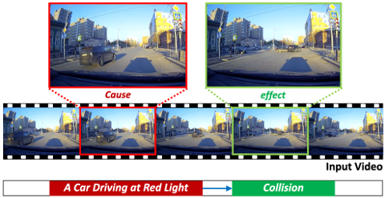

# Causality In Traffic Accident
Repository for Traffic Accident Benchmark for Causality Recognition (ECCV 2020)

## Overview


Main contributions of the [paper](https://www.ecva.net/papers/eccv_2020/papers_ECCV/papers/123520528.pdf)
- We introduce a traffic accident analysis benchmark, denoted by CTA, which contains temporal intervals of a cause and an effect in each accident and their semantic labels provided by [the crash avoidance research](https://rosap.ntl.bts.gov/view/dot/6281).
- We construct the dataset based on the semantic taxonomy in the crash avoidance research, which makes the distribution of the benchmark coherent to the semantic taxonomy and the real-world statistics.
- We analyze traffic accident tasks by comparing multiple algorithms for temporal cause and effect event localization.

## Dataset Preparation
[Details of dataset](dataset/DATASET.md)

## Benchmark
### Cause and Effect Event Classification
We adopt Temporal Segment Networks (ECCV 2016) in our benchmark.
- The default arguments for code are set to train TSN with average consensus function.
```
python train_classifier.py --consensus_type average --random_seed 17
python train_classifier.py --consensus_type linear --random_seed 3
```

- The performance of classification models with above arguments is shown in below.

| TSN     | Cause Top-1 | Cause Top-2 | Effect Top-1 | Effect Top-2 |
| ------- |:-----------:|:-----------:|:------------:|:------------:|
| Average | 25.00       | 32.25       | 43.75        | 87.50        |
| Linear  | 31.25       | 37.50       | 87.50        | 93.75        |


### Temporal Cause and Effect Event Localization (Under-Construction)
We adopt three types of baseline methods in our benchmark.

- Single-stage Action Detection
```
python train_localization.py --architecture_type forward-SST
python train_localization.py --architecture_type backward-SST
python train_localization.py --architecture_type bi-SST
python train_localization.py --architecture_type SSTCN-SST
```

- Action Segmentation
```
python train_localization.py --architecture_type SSTCN-Segmentation
python train_localization.py --architecture_type MSTCN-Segmentation
```

- Proposal-based Action Detection (not supported yet)
```
python train_localization.py --architecture_type naive-conv-R-C3D
python train_localization.py --architecture_type SSTCN-R-C3D
``` 

### Citation

```
@inproceedings{you2020CTA,
    title     = "{Traffic Accident Benchmark for Causality Recognition}",
    author    = {You, Tackgeun and Han, Bohyung},
    booktitle = {ECCV},
    year      = {2020}
}
```
