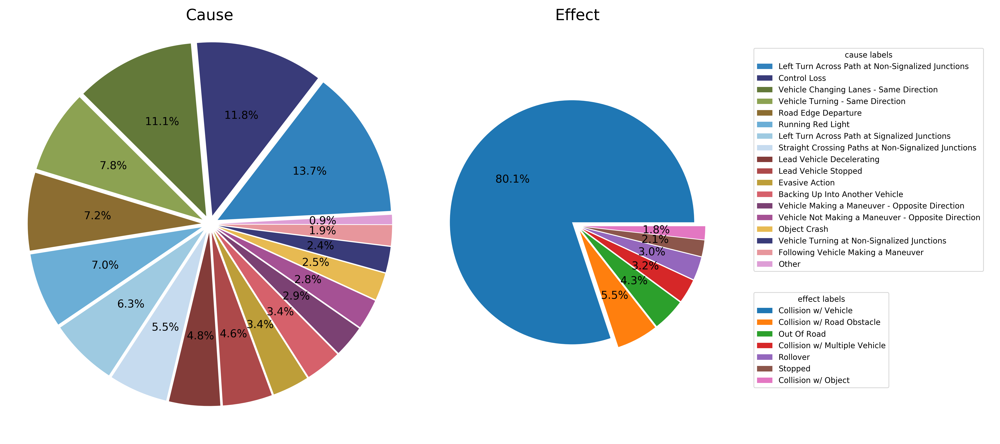
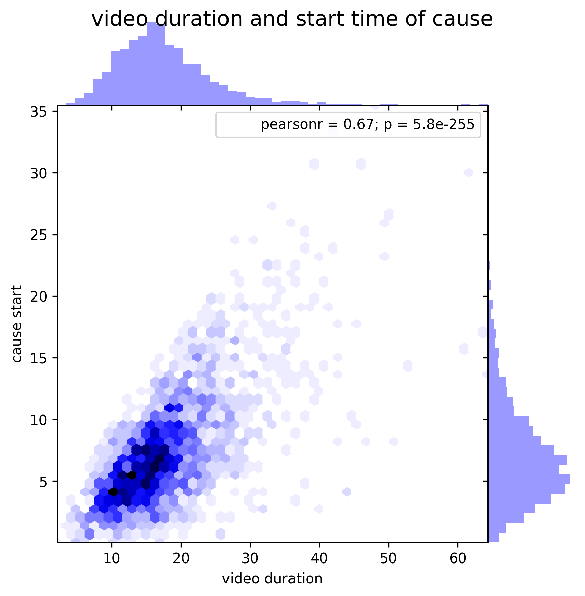

# Details of dataset construction

## Download features
Download two RGB features extracted from i3d
- [RGB](https://www.dropbox.com/s/s3b7r4cpbr6uqd5/i3d-rgb-fps25-Mar9th.pt?dl=0)
- [flipped-RGB](https://www.dropbox.com/s/0kiikl2yjco0xvn/i3d-rgb-flip-fps25-Mar9th.pt?dl=0)

## Statistics of dataset
### Semantic Taxonomy for Cause and Effect Events

### Temporal Intervals

## The Other Details
Annotation tool
- We use [BeaverDam](https://github.com/antingshen/BeaverDam) to annotate cause and effect event in an accident video.

