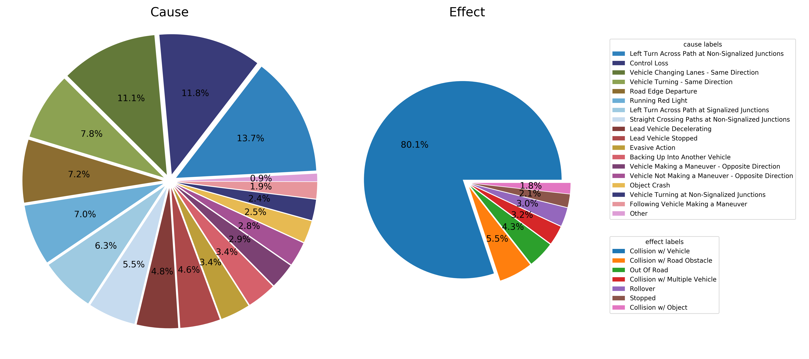
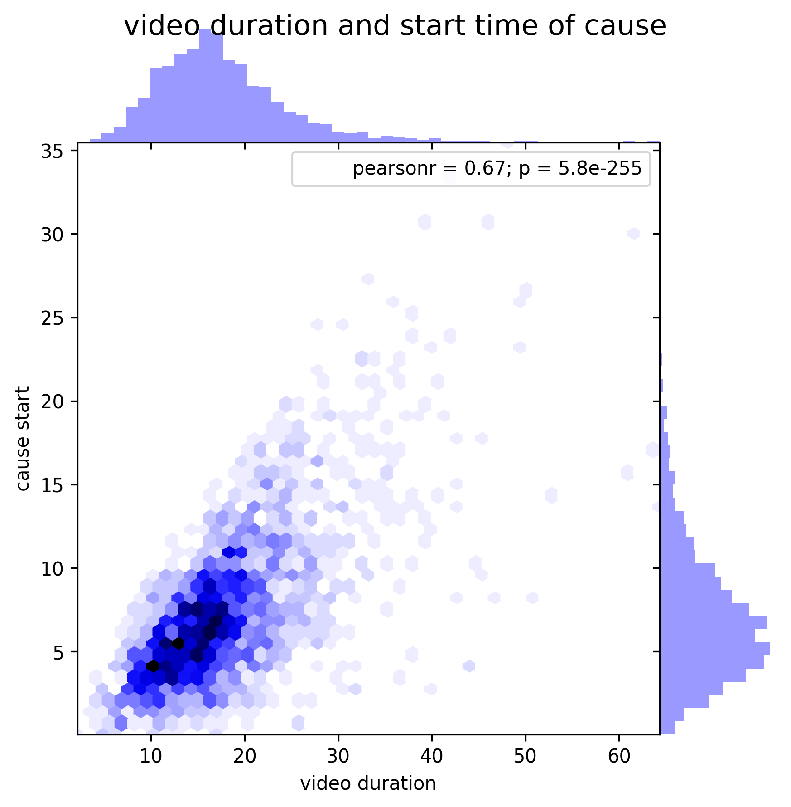
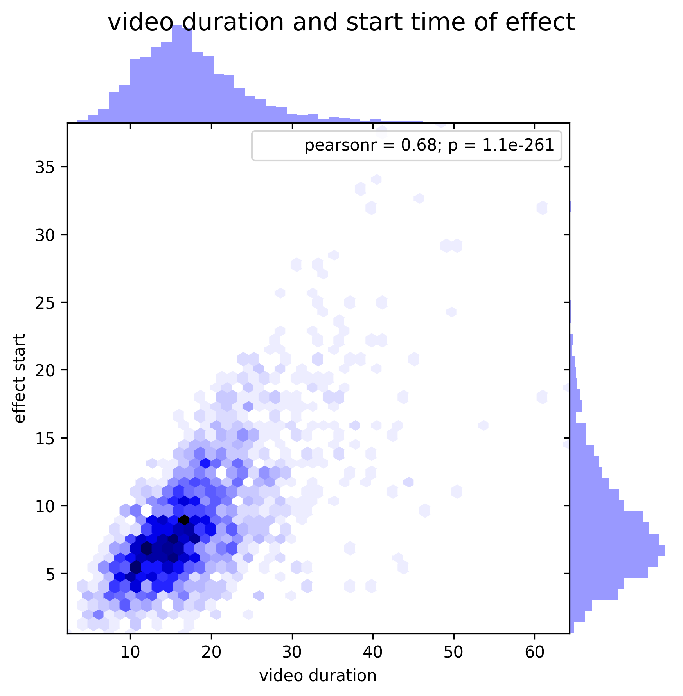

# Details of dataset construction

## Download features
Download two RGB features extracted from [Kinetics-I3D-PyTorch](https://github.com/rimchang/kinetics-i3d-Pytorch).
- [download RGB](https://www.dropbox.com/s/s3b7r4cpbr6uqd5/i3d-rgb-fps25-Mar9th.pt?dl=0)
- [download flipped-RGB](https://www.dropbox.com/s/0kiikl2yjco0xvn/i3d-rgb-flip-fps25-Mar9th.pt?dl=0)

## Annotation format
The annotation file in the repository (*dataset/annotation-Mar9th-25fps.pkl*) contains the list for causality annotation each video and its meta information.

* Each element in the list has video meta information and cause and effect event labels.
- (Youtube clip ID, start time in Youtube clip, end time in Youtube clip) ; traffic accident video information
- (cause semantic label, cause start time, cause end time, cause semantic label index) ; cause annotation
- (effect semantic label, effect start time, effect end time, effect semantic label index) ; effect annotation

## Statistics of dataset
### Class Labels of Cause and Effect Events

### Temporal Intervals of Cause and Effect Events

## Semantic Taxonomy of Traffic Accident
We have 17 and 7 semantic labels for cause and effect event correspondingly.

- For cause labels, we adopt semantic taxonomy introduced in [the crash avoidance research](https://rosap.ntl.bts.gov/view/dot/6281). The research introduced a new typology of pre-crash scenario of traffic accident. The typology of pre-crash serves as a semantic taxonomy of cause events in traffic accident. We merge labels *With Prior Vehicle Action* and *Without Prior Vehicle Action* into the same labels because it is hard to be dicriminated by only watching video in many traffic accidents.
- For effect event, we use 7 semantic labels which frequently appeared in collected videos with traffic accident.
- The prior distributions of both cause and effect event can be calculated by aggregating ocurrences of individual cause and effect events in the research, which is shown in figure 4 of the paper.

## The Other Details
### Annotation tool
- We modify [BeaverDam](https://github.com/antingshen/BeaverDam) to support both temporal regions and spatio-temporal regions of cause and effect event.
- But, we annotate videos with temporal localization due to an expensive annotation cost and the ambiguity of cause event of accident in spatio-temporal regions.
